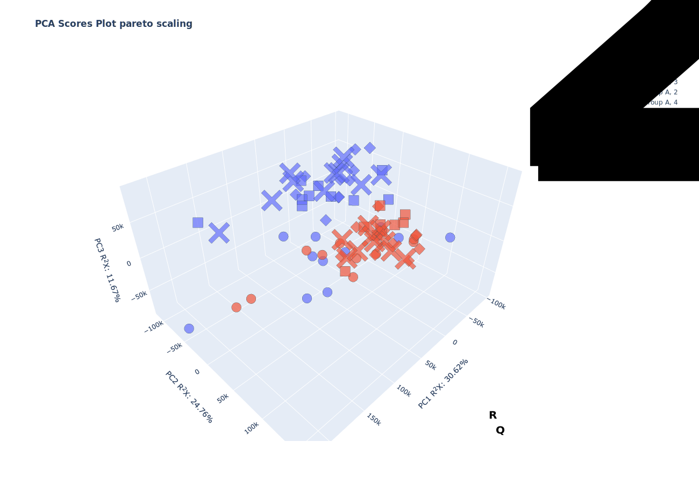
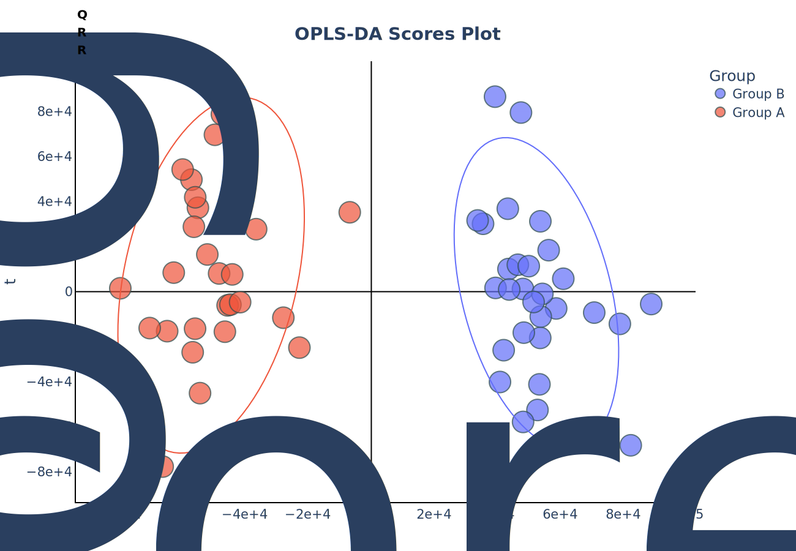
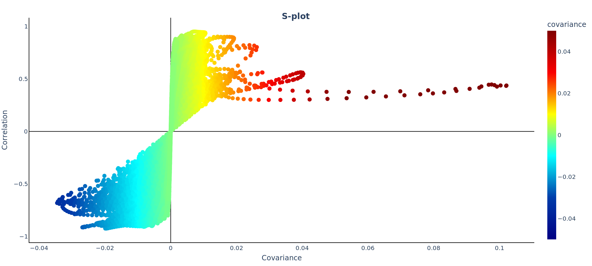
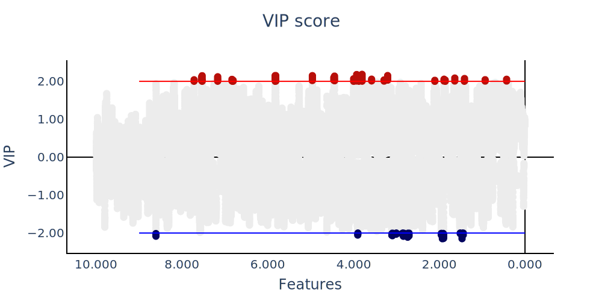

# metbit

Metbit is a Python package designed for the analysis of metabolomics data. It provides a range of tools and functions to process, visualize, and interpret metabolomics datasets. With Metbit, you can perform various statistical analyses, identify biomarkers, and generate informative visualizations to gain insights into your metabolomics experiments. Whether you are a researcher, scientist, or data analyst working in the field of metabolomics, Metbit can help streamline your data analysis workflow and facilitate the interpretation of complex metabolomics data.


# How to install

```bash
pip install metbit
```
# Features: 

[1. PCA model and visualisation](#principal-component-analysis)

[2. OPLS-DA model and visualisation](#orthogonal-partial-least-squares-discriminant-analysis-(opls-da))

[3. STOCSY and STOCSY app](src/page/STOCSY.md)

# Example:

# **Principal component analysis**

PCA is used to transform a large set of variables into a smaller one
that still contains most of the information in the large set. This is
particularly useful when dealing with high-dimensional data, where
visualizing and analyzing the data can be challenging.

To perform Principal Component Analysis (PCA) in a Python environment,
you can use the metbit library. Here\'s a step-by-step guide to import
the necessary package and perform PCA:

``` python
import pandas as pd
from metbit import pca
```

``` python
df = pd.read_csv("metbit_tutorial_data.csv")
```


Use .iloc or df.head(10)[df.columns[:10]] to display 10 rows and 10 columns first

```python
df.iloc[:10, :10]
```
Output:


| Group   |   Time point |       0.0 |   0.0001716414 |   0.0003432828 |   0.0005149242 |   0.0006865656 |   0.000858207 |   0.0010298484 |   0.0012014898 |
|:--------|-------------:|----------:|---------------:|---------------:|---------------:|---------------:|--------------:|---------------:|---------------:|
| Group B |            3 |  3024.2   |       3923.9   |       4758.23  |       4551.28  |       3737.53  |      3469.81  |       3646.49  |      3278.41   |
| Group A |            3 |  3776.08  |       3441.18  |       3479.89  |       4102.29  |       5089.12  |      6000.92  |       6556.49  |      6687.83   |
| Group A |            2 |  3823.99  |       3227.06  |       2793.23  |       2544.2   |       2254.06  |      1843.89  |       1470.21  |      1362.43   |
| Group B |            2 | 21926     |      21546.2   |      21155.6   |      20190.6   |      18755.6   |     17993.4   |      18545.5   |     19496.6    |
| Group A |            4 |  2997.22  |       2130.68  |       1993.8   |       2948.87  |       4414.49  |      5267.69  |       4897.94  |      3868.98   |
| Group B |            4 | 12988.5   |      14361.2   |      15288.7   |      15439.6   |      15410.4   |     15513.2   |      15528     |     15446.5    |
| Group A |            2 |   202.293 |        111.968 |        640.931 |       1732.62  |       2926.78  |      3299.18  |       2308.54  |       783.053  |
| Group A |            3 |  4813.91  |       4822.44  |       4153.81  |       2861.74  |       1405.9   |       575.416 |        725.433 |      1315.78   |
| Group A |            4 | 34822.5   |      34380.2   |      33536.9   |      32369.3   |      31296.5   |     30737.1   |      30694.3   |     30909.4    |
| Group A |            4 |   124.841 |        677.809 |        841.232 |        659.092 |        479.715 |       438.279 |        323.827 |       -43.9303 |


## **Assign object to perform PCA**

X: data frame of features to test

features_name: features name of X data frame

color_: series of group to label with color

symbol_: series of time point to label with symbol

time_order: assign order of symbol

``` python
X = df.iloc[:, 2:]
features_name = X.columns.astype(float).to_list()
color_ = df["Group"]
symbol_ = df["Time point"]
time_order = {1:0, 2:1, 3:2, 4:2}
```

Assign and fit PCA model
``` python
pca_mod = pca(X=X, label=color_, features_name=ppm, n_components=3)
pca_mod.fit()
```

## **Visualisation**

```python
pca_mod.plot_cumulative_observed()
```
Output:


``` python
pca_mod.plot_pca_scores(pc=["PC1", "PC2"], symbol_=symbol_)
```
Output:


```python
pca_mod.plot_pca_scores(pc=["PC1", "PC3"], symbol_=symbol_)
```
Output:


``` python
pca_mod.plot_3d_pca(marker_size=10, symbol_=symbol_)
```
Output:



To observe time series of PCA you can perform times trajectory plot use function plot_trajectory

``` python
pca_mod.plot_pca_trajectory(time_=symbol_, time_order=time_order, pc=["PC1", "PC2"])
```
Output:


``` python
pca_mod.plot_pca_trajectory(time_=symbol_, time_order=time_order, pc=["PC1", "PC3"])
```
Output:

# **Orthogonal Partial Least Squares Discriminant Analysis (OPLS-DA)**

Orthogonal Partial Least Squares Discriminant Analysis (OPLS-DA) was
proposed by Prof. Svante Wold in 2002 as a variant of PLS-DA, using a
mathematical filter to remove systematic variance unrelated to the
sample class. This is particularly advantageous in metabolomics, such as
distinguishing the metabolomic signature of coronary disease without
confounding factors like sex. However, OPLS-DA is less common than
PLS-DA due to increased risk of overfitting and its limitation to binary
classification.


``` python

from metbit import opls_da 
import pandas as pd 
```

1.  Load the data and data manipulation

``` python
df = pd.read_csv("metbit_tutorial_data.csv")
#Exclude base line (Time point 1)
df.drop(df.loc[df["Time point"]==1].index, inplace=True)
```

``` python
X = df.iloc[:, 2:]
ppm = X.columns.astype(float).to_list()
y = df["Group"]
```

``` python
opls_da_mod = opls_da(X=X, y=y, features_name=ppm, scale='uv', auto_ncomp=True)
```

``` python
opls_da_mod.fit()
```
Output:

OPLS-DA model is fitted in 2.5721652507782 seconds


## **Visualisation**


``` python
opls_da_mod.plot_oplsda_scores()
```
Output:


``` python
opls_da_mod.plot_loading()
```
Output:

``` python
opls_da_mod.plot_s_scores()
```
Output:


``` python
opls_da_mod.permutation_test(n_permutations=100, n_jobs=-1)
```
Output:

    [Parallel(n_jobs=-1)]: Using backend LokyBackend with 8 concurrent workers.
    [Parallel(n_jobs=-1)]: Done   2 tasks      | elapsed:    8.5s
    [Parallel(n_jobs=-1)]: Done   9 tasks      | elapsed:   11.1s
    [Parallel(n_jobs=-1)]: Done  16 tasks      | elapsed:   13.2s
    [Parallel(n_jobs=-1)]: Done  25 tasks      | elapsed:   17.5s
    [Parallel(n_jobs=-1)]: Done  34 tasks      | elapsed:   20.8s
    [Parallel(n_jobs=-1)]: Done  45 tasks      | elapsed:   23.7s
    [Parallel(n_jobs=-1)]: Done  56 tasks      | elapsed:   27.4s
    [Parallel(n_jobs=-1)]: Done  69 tasks      | elapsed:   33.5s
    [Parallel(n_jobs=-1)]: Done  82 tasks      | elapsed:   37.9s
    [Parallel(n_jobs=-1)]: Done  96 out of 100 | elapsed:   42.7s remaining:    1.8s


    Permutation test is performed in 46.19982290267944 seconds

    [Parallel(n_jobs=-1)]: Done 100 out of 100 | elapsed:   43.6s finished


opls_da_mod.plot_hist()
```
Output:


``` python
opls_da_mod.vip_scores()
opls_da_mod.vip_plot(threshold=2)
```
Output:



---
Publication:

Karunasumetta C, Tourthong W, Mala R, Chatgasem C, Bubpamala T, Punchai S, Sawanyawisuth K. Comparative Analysis of Metabolomic Responses in On-Pump and Off-Pump Coronary Artery Bypass Grafting. Ann Thorac Cardiovasc Surg. 2024;30(1):24-00126. doi: 10.5761/atcs.oa.24-00126. PMID: 39631940; PMCID: PMC11634389.
