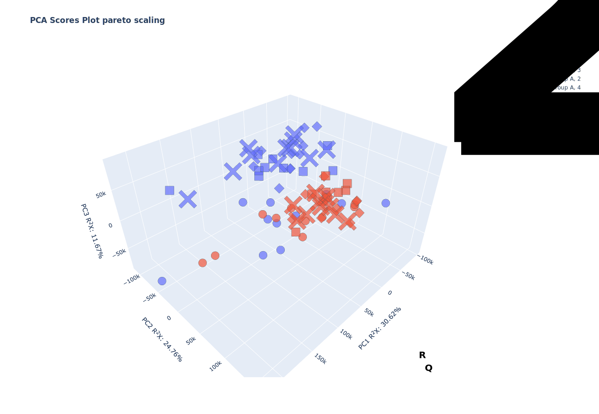
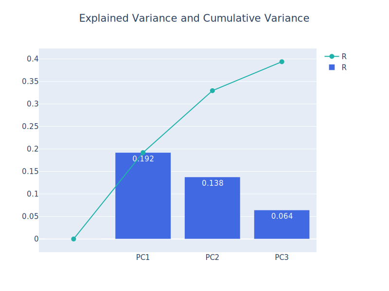
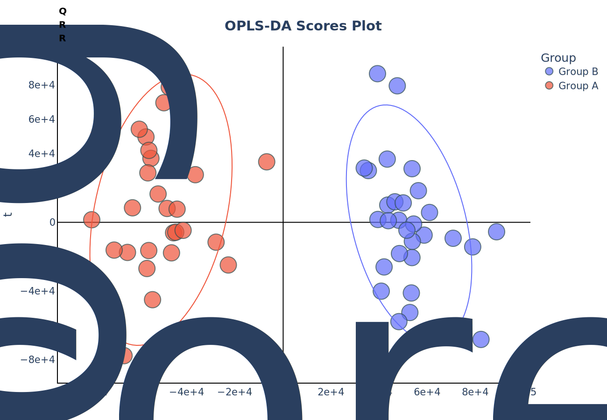
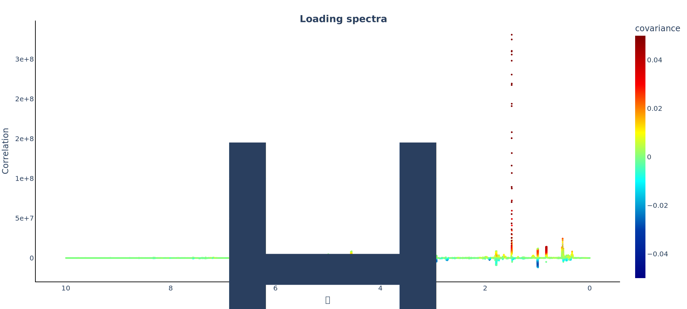
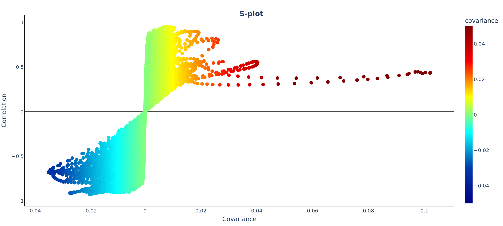
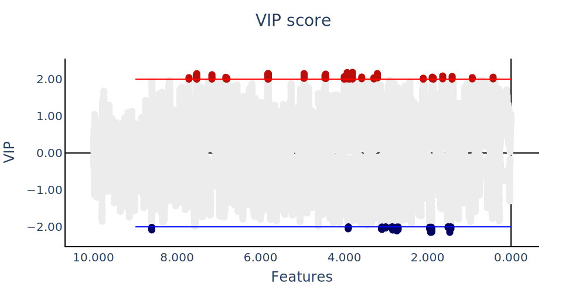

metbit
======

Metbit is a Python package designed for the analysis of metabolomics
data. It provides a range of tools and functions to process, visualize,
and interpret metabolomics datasets. With Metbit, you can perform
various statistical analyses, identify biomarkers, and generate
informative visualizations to gain insights into your metabolomics
experiments. Whether you are a researcher, scientist, or data analyst
working in the field of metabolomics, Metbit can help streamline your
data analysis workflow and facilitate the interpretation of complex
metabolomics data.

How to install
==============

.. code:: bash

   pip install metbit

Example:
========

**Principal component analysis**
================================

PCA is used to transform a large set of variables into a smaller one
that still contains most of the information in the large set. This is
particularly useful when dealing with high-dimensional data, where
visualizing and analyzing the data can be challenging.

To perform Principal Component Analysis (PCA) in a Python environment,
you can use the metbit library. Here's a step-by-step guide to import
the necessary package and perform PCA:

.. code:: python

   import pandas as pd
   from metbit import pca

.. code:: python

   df = pd.read_csv("metbit_tutorial_data.csv")

Use .iloc or df.head(10)[df.columns[:10]] to display 10 rows and 10
columns first

.. code:: python

   df.iloc[:10, :10]

Output:

+---+-----+----+------+------+------+------+------+------+------+
| G | T   | 0  | 0.00 | 0.00 | 0.00 | 0.00 | 0.0  | 0.00 | 0.00 |
| r | ime | .0 | 0171 | 0343 | 0514 | 0686 | 0085 | 1029 | 1201 |
| o | po  |    | 6414 | 2828 | 9242 | 5656 | 8207 | 8484 | 4898 |
| u | int |    |      |      |      |      |      |      |      |
| p |     |    |      |      |      |      |      |      |      |
+===+=====+====+======+======+======+======+======+======+======+
| G | 3   | 30 | 39   | 475  | 455  | 373  | 346  | 364  | 327  |
| r |     | 24 | 23.9 | 8.23 | 1.28 | 7.53 | 9.81 | 6.49 | 8.41 |
| o |     | .2 |      |      |      |      |      |      |      |
| u |     |    |      |      |      |      |      |      |      |
| p |     |    |      |      |      |      |      |      |      |
| B |     |    |      |      |      |      |      |      |      |
+---+-----+----+------+------+------+------+------+------+------+
| G | 3   | 3  | 344  | 347  | 410  | 508  | 600  | 655  | 668  |
| r |     | 77 | 1.18 | 9.89 | 2.29 | 9.12 | 0.92 | 6.49 | 7.83 |
| o |     | 6. |      |      |      |      |      |      |      |
| u |     | 08 |      |      |      |      |      |      |      |
| p |     |    |      |      |      |      |      |      |      |
| A |     |    |      |      |      |      |      |      |      |
+---+-----+----+------+------+------+------+------+------+------+
| G | 2   | 3  | 322  | 279  | 25   | 225  | 184  | 147  | 136  |
| r |     | 82 | 7.06 | 3.23 | 44.2 | 4.06 | 3.89 | 0.21 | 2.43 |
| o |     | 3. |      |      |      |      |      |      |      |
| u |     | 99 |      |      |      |      |      |      |      |
| p |     |    |      |      |      |      |      |      |      |
| A |     |    |      |      |      |      |      |      |      |
+---+-----+----+------+------+------+------+------+------+------+
| G | 2   | 2  | 215  | 211  | 201  | 187  | 179  | 185  | 194  |
| r |     | 19 | 46.2 | 55.6 | 90.6 | 55.6 | 93.4 | 45.5 | 96.6 |
| o |     | 26 |      |      |      |      |      |      |      |
| u |     |    |      |      |      |      |      |      |      |
| p |     |    |      |      |      |      |      |      |      |
| B |     |    |      |      |      |      |      |      |      |
+---+-----+----+------+------+------+------+------+------+------+
| G | 4   | 2  | 213  | 19   | 294  | 441  | 526  | 489  | 386  |
| r |     | 99 | 0.68 | 93.8 | 8.87 | 4.49 | 7.69 | 7.94 | 8.98 |
| o |     | 7. |      |      |      |      |      |      |      |
| u |     | 22 |      |      |      |      |      |      |      |
| p |     |    |      |      |      |      |      |      |      |
| A |     |    |      |      |      |      |      |      |      |
+---+-----+----+------+------+------+------+------+------+------+
| G | 4   | 1  | 143  | 152  | 154  | 154  | 155  | 1    | 154  |
| r |     | 29 | 61.2 | 88.7 | 39.6 | 10.4 | 13.2 | 5528 | 46.5 |
| o |     | 88 |      |      |      |      |      |      |      |
| u |     | .5 |      |      |      |      |      |      |      |
| p |     |    |      |      |      |      |      |      |      |
| B |     |    |      |      |      |      |      |      |      |
+---+-----+----+------+------+------+------+------+------+------+
| G | 2   | 2  | 111  | 640  | 173  | 292  | 329  | 230  | 783  |
| r |     | 02 | .968 | .931 | 2.62 | 6.78 | 9.18 | 8.54 | .053 |
| o |     | .2 |      |      |      |      |      |      |      |
| u |     | 93 |      |      |      |      |      |      |      |
| p |     |    |      |      |      |      |      |      |      |
| A |     |    |      |      |      |      |      |      |      |
+---+-----+----+------+------+------+------+------+------+------+
| G | 3   | 4  | 482  | 415  | 286  | 14   | 575  | 725  | 131  |
| r |     | 81 | 2.44 | 3.81 | 1.74 | 05.9 | .416 | .433 | 5.78 |
| o |     | 3. |      |      |      |      |      |      |      |
| u |     | 91 |      |      |      |      |      |      |      |
| p |     |    |      |      |      |      |      |      |      |
| A |     |    |      |      |      |      |      |      |      |
+---+-----+----+------+------+------+------+------+------+------+
| G | 4   | 3  | 343  | 335  | 323  | 312  | 307  | 306  | 309  |
| r |     | 48 | 80.2 | 36.9 | 69.3 | 96.5 | 37.1 | 94.3 | 09.4 |
| o |     | 22 |      |      |      |      |      |      |      |
| u |     | .5 |      |      |      |      |      |      |      |
| p |     |    |      |      |      |      |      |      |      |
| A |     |    |      |      |      |      |      |      |      |
+---+-----+----+------+------+------+------+------+------+------+
| G | 4   | 1  | 677  | 841  | 659  | 479  | 438  | 323  | -43. |
| r |     | 24 | .809 | .232 | .092 | .715 | .279 | .827 | 9303 |
| o |     | .8 |      |      |      |      |      |      |      |
| u |     | 41 |      |      |      |      |      |      |      |
| p |     |    |      |      |      |      |      |      |      |
| A |     |    |      |      |      |      |      |      |      |
+---+-----+----+------+------+------+------+------+------+------+

**Assign object to perform PCA**
--------------------------------

X: data frame of features to test features_name: features name of X data
frame color_: series of group to label with color symbol_: series of
time point to label with symbol time_order: assign order of symbol

.. code:: python

   X = df.iloc[:, 2:]
   features_name = X.columns.astype(float).to_list()
   color_ = df["Group"]
   symbol_ = df["Time point"]
   time_order = {1:0, 2:1, 3:2, 4:2}

Assign and fit PCA model

.. code:: python

   pca_mod = pca(X=X, label=color_, features_name=ppm, n_components=3)
   pca_mod.fit()

**Visualisation**
-----------------

.. code:: python

   pca_mod.plot_cumulative_observed()

Output: |Cumurative varian|

.. code:: python

   pca_mod.plot_pca_scores(pc=["PC1", "PC2"], symbol_=symbol_)

Output: |PCA scores plot|

.. code:: python

   pca_mod.plot_pca_scores(pc=["PC1", "PC3"], symbol_=symbol_).write_image("pca_scores[PC1-PC3].svg")

Output:

.. figure:: ./src/img/pca_scores%5BPC1-PC3%5D.svg
   :alt: PCA scores plot

   PCA scores plot

.. code:: python

   pca_mod.plot_3d_pca(marker_size=10, symbol_=symbol_).write_image("3d_pca.svg")

Output:



   3D plot

To observe time series of PCA you can perform times trajectory plot use
function plot_trajectory

.. code:: python

   pca_mod.plot_pca_trajectory(time_=symbol_, time_order=time_order, pc=["PC1", "PC2"])

Output:

.. figure:: ./src/img/pca_trajectory%5BPC1-PC2%5D.svg
   :alt: Trajectory plot

   Trajectory plot

.. code:: python

   pca_mod.plot_pca_trajectory(time_=symbol_, time_order=time_order, pc=["PC1", "PC3"])

Output: |trajectory plot| # **Orthogonal Partial Least Squares
Discriminant Analysis (OPLS-DA)**

Orthogonal Partial Least Squares Discriminant Analysis (OPLS-DA) was
proposed by Prof. Svante Wold in 2002 as a variant of PLS-DA, using a
mathematical filter to remove systematic variance unrelated to the
sample class. This is particularly advantageous in metabolomics, such as
distinguishing the metabolomic signature of coronary disease without
confounding factors like sex. However, OPLS-DA is less common than
PLS-DA due to increased risk of overfitting and its limitation to binary
classification.

.. code:: python


   from metbit import opls_da 
   import pandas as pd 

1. Load the data and data manipulation

.. code:: python

   df = pd.read_csv("metbit_tutorial_data.csv")
   #Exclude base line (Time point 1)
   df.drop(df.loc[df["Time point"]==1].index, inplace=True)

.. code:: python

   X = df.iloc[:, 2:]
   ppm = X.columns.astype(float).to_list()
   y = df["Group"]

.. code:: python

   opls_da_mod = opls_da(X=X, y=y, features_name=ppm, scale='uv', auto_ncomp=True)

.. code:: python

   opls_da_mod.fit()

Output:

OPLS-DA model is fitted in 2.5721652507782 seconds

.. _visualisation-1:

**Visualisation**
-----------------

.. code:: python

   opls_da_mod.plot_oplsda_scores()

Output: |opls da scores|

.. code:: python

   opls_da_mod.plot_loading()

Output: |opls da loading|

.. code:: python

   opls_da_mod.plot_s_scores()

Output: |opls da S scores|

.. code:: python

   opls_da_mod.permutation_test(n_permutations=100, n_jobs=-1)

Output:

::

   [Parallel(n_jobs=-1)]: Using backend LokyBackend with 8 concurrent workers.
   [Parallel(n_jobs=-1)]: Done   2 tasks      | elapsed:    8.5s
   [Parallel(n_jobs=-1)]: Done   9 tasks      | elapsed:   11.1s
   [Parallel(n_jobs=-1)]: Done  16 tasks      | elapsed:   13.2s
   [Parallel(n_jobs=-1)]: Done  25 tasks      | elapsed:   17.5s
   [Parallel(n_jobs=-1)]: Done  34 tasks      | elapsed:   20.8s
   [Parallel(n_jobs=-1)]: Done  45 tasks      | elapsed:   23.7s
   [Parallel(n_jobs=-1)]: Done  56 tasks      | elapsed:   27.4s
   [Parallel(n_jobs=-1)]: Done  69 tasks      | elapsed:   33.5s
   [Parallel(n_jobs=-1)]: Done  82 tasks      | elapsed:   37.9s
   [Parallel(n_jobs=-1)]: Done  96 out of 100 | elapsed:   42.7s remaining:    1.8s


   Permutation test is performed in 46.19982290267944 seconds

   [Parallel(n_jobs=-1)]: Done 100 out of 100 | elapsed:   43.6s finished

opls_da_mod.plot_hist()

::

   Output:
   

   ``` python
   opls_da_mod.vip_scores()
   opls_da_mod.vip_plot(threshold=2)

Output: |opls da VIP score|

**Additional**
==============

**Lazy OPLS-DA**
================

.. code:: python

   import pandas as pd
   from metbit import lazy_opls_da

.. code:: python

   df = pd.read_csv("metbit_tutorial_data.csv")

.. code:: python

   X = df.iloc[:, 2:]
   ppm = X.columns.astype(float).to_list()
   # Perform class by combind Group and Time point
   df["Class"] = df["Group"] + ", " + df["Time point"].astype(str)
   y = df["Class"]

.. code:: python

   working_dir = "/path/to/working/directory/"
   lazy_mod = lazy_opls_da(data=X, groups=y,working_dir=working_dir, auto_ncomp=True, permutation=True, VIP=True, linear_regression=True)

::

           Project Name: 2024-06-26 13:34:49_PulsePioneer
           Number of groups: 8
           Number of samples: 81
           Number of features: 58262
           Number of components: 2
           Estimator: opls
           Scaling: pareto
           Kfold: 3
           Random state: 94
           Auto ncomp: True
           Working directory: /Volumes/CAS9/Aeiwz/test flight/metbit tutorial
           Permutation: True
           VIP: True
           Linear regression: True
           

.. code:: python

   lazy_mod.fit()

::

   [Parallel(n_jobs=4)]: Using backend LokyBackend with 4 concurrent workers.
   [Parallel(n_jobs=4)]: Done   5 tasks      | elapsed:    6.7s
   [Parallel(n_jobs=4)]: Done  10 tasks      | elapsed:    9.1s
   [Parallel(n_jobs=4)]: Done  17 tasks      | elapsed:   12.9s
   [Parallel(n_jobs=4)]: Done  24 tasks      | elapsed:   15.9s
   [Parallel(n_jobs=4)]: Done  33 tasks      | elapsed:   20.7s
   [Parallel(n_jobs=4)]: Done  42 tasks      | elapsed:   24.2s
   [Parallel(n_jobs=4)]: Done  53 tasks      | elapsed:   28.4s
   [Parallel(n_jobs=4)]: Done  64 tasks      | elapsed:   32.4s
   [Parallel(n_jobs=4)]: Done  77 tasks      | elapsed:   37.6s
   [Parallel(n_jobs=4)]: Done  90 tasks      | elapsed:   42.1s
   [Parallel(n_jobs=4)]: Done 100 out of 100 | elapsed:   45.9s finished

   Permutation test is performed in 48.356366872787476 seconds


   Creating data frame: 100%|██████████| 58262/58262 [00:00<00:00, 1792662.19it/s]
   Features processed: 58262it [01:22, 707.95it/s]                    


   adjustment p-value with Benjamini/Hochberg (non-negative) Done
   OPLS-DA model is fitted in 1.6124029159545898 seconds

   [Parallel(n_jobs=4)]: Using backend LokyBackend with 4 concurrent workers.
   [Parallel(n_jobs=4)]: Done   5 tasks      | elapsed:    3.3s
   [Parallel(n_jobs=4)]: Done  10 tasks      | elapsed:    4.9s
   [Parallel(n_jobs=4)]: Done  17 tasks      | elapsed:    7.8s
   [Parallel(n_jobs=4)]: Done  24 tasks      | elapsed:   10.0s
   [Parallel(n_jobs=4)]: Done  33 tasks      | elapsed:   13.8s
   [Parallel(n_jobs=4)]: Done  42 tasks      | elapsed:   17.5s
   [Parallel(n_jobs=4)]: Done  53 tasks      | elapsed:   21.6s
   [Parallel(n_jobs=4)]: Done  64 tasks      | elapsed:   25.6s
   [Parallel(n_jobs=4)]: Done  77 tasks      | elapsed:   30.2s
   [Parallel(n_jobs=4)]: Done  90 tasks      | elapsed:   35.0s
   [Parallel(n_jobs=4)]: Done 100 out of 100 | elapsed:   38.6s finished

   Permutation test is performed in 40.054511070251465 seconds

   Creating data frame: 100%|██████████| 58262/58262 [00:00<00:00, 3837626.45it/s]
   Features processed: 15662it [00:21, 732.89it/s]


.. |PCA scores plot| image:: ./src/img/pca_scores%5BPC1-PC2%5D.svg
.. |trajectory plot| image:: ./src/img/pca_trajectory%5BPC1-PC3%5D.svg




