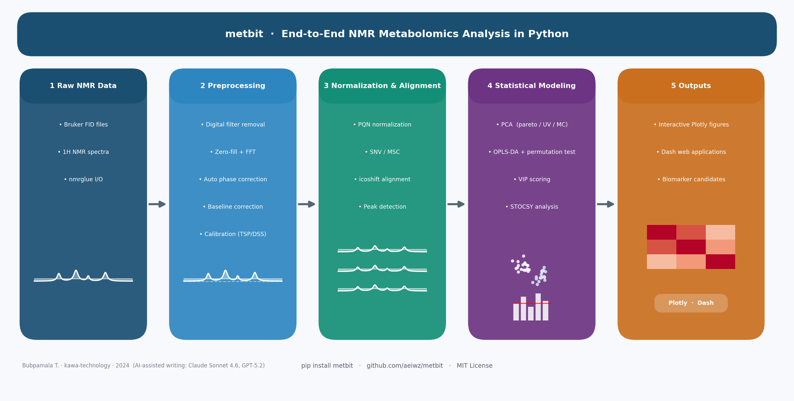
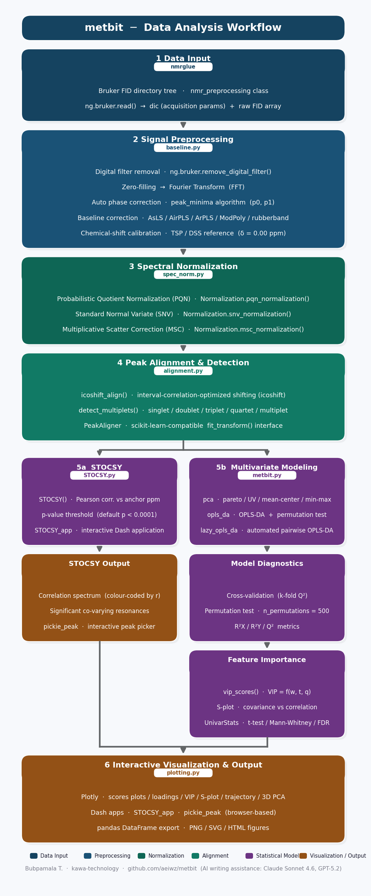

# metbit: An Integrated Python Package for End-to-End NMR-Based Metabolomics Data Analysis

---

**Authors**

Theerayut Bubpamala¹\*

¹ kawa-technology, Independent Research & Development

\* Corresponding author: theerayut_aeiw_123@hotmail.com  
  GitHub: https://github.com/aeiwz/metbit  
  PyPI: https://pypi.org/project/metbit/

---

**Figure GA.** Graphical abstract summarizing the five-stage metbit pipeline: raw Bruker NMR data input, signal preprocessing, spectral normalization and peak alignment, statistical modeling (PCA, OPLS-DA, STOCSY), and interactive output generation.

---

## Abstract

**Motivation:** Nuclear magnetic resonance (NMR) spectroscopy is a cornerstone of untargeted metabolomics, yet the computational tools for transforming raw acquisitions into biological insights are fragmented across incompatible software ecosystems. No single Python package currently integrates the full workflow from raw data input through preprocessing, alignment, and multivariate statistical modeling.

**Results:** We present **metbit** (version 8.7.7), an open-source Python package that unifies the complete NMR metabolomics analytical pipeline. metbit automates raw Bruker data processing, spectral normalization (PQN, MSC), peak alignment (icoshift), and production-quality statistical modeling (PCA, OPLS-DA) with cross-validation and permutation testing. All outputs are rendered as interactive Plotly figures, and Dash-based graphical applications are included for STOCSY exploration and peak picking. metbit reduces software dependency overhead and promotes reproducible, scriptable metabolomics research.

**Availability and Implementation:** metbit is released under the MIT license and is available on PyPI (`pip install metbit`). Source code and documentation are hosted at https://github.com/aeiwz/metbit and https://metbit-docs.vercel.app.

**Keywords:** metabolomics; NMR spectroscopy; chemometrics; OPLS-DA; PCA; Python; open-source bioinformatics

---

## 1. Introduction

Proton nuclear magnetic resonance (¹H NMR) spectroscopy is an essential platform for untargeted metabolomics due to its quantitative accuracy and non-destructive sample handling (Emwas et al., 2019). However, the journey from raw free-induction decay (FID) files to interpretable multivariate models involves complex sequential steps, including preprocessing, normalization, and alignment. While open-source tools such as NMRglue (Helmus and Jaroniec, 2013) and MetaboAnalyst (Pang et al., 2022) address parts of this pipeline, the Python ecosystem lacks a single, scriptable library that integrates the entire NMR metabolomics workflow natively.

We present **metbit**, an end-to-end Python package that consolidates NMR data processing and multivariate modeling into a coherent API. metbit bridges the gap between raw spectral acquisitions and biological conclusions, delivering publication-quality interactive visualizations and reproducible workflows.

---

## 2. Implementation

metbit is a pure Python package (≥ 3.10) built on the scientific Python stack (NumPy, SciPy, scikit-learn, and Plotly). Its architecture follows a linear coherence principle, where outputs from each processing stage serve as valid inputs for the next (Figure 1).

### 2.1 NMR Preprocessing and Alignment
The `nmr_preprocessing` module automates the conversion of raw Bruker FID directories into frequency-domain spectra. The pipeline includes digital filter removal, zero-filling, Fourier transformation, and automated phase correction. metbit provides a unified interface for baseline correction (AsLS, AirPLS, and rubberband methods) and chemical-shift calibration.

To address sample-to-sample concentration variation and chemical-shift drift, metbit implements Probabilistic Quotient Normalization (PQN; Dieterle et al., 2006) and interval-correlation-optimized shifting (icoshift; Savorani et al., 2010). A scikit-learn-compatible `PeakAligner` class enables these preprocessing steps to be integrated into broader machine-learning pipelines.

### 2.2 Multivariate Statistical Modeling
metbit provides robust implementations of Principal Component Analysis (PCA) and Orthogonal Partial Least Squares Discriminant Analysis (OPLS-DA). The OPLS-DA module handles binary classification with automated component selection, permutation testing, and Variable Importance in Projection (VIP) scoring. All models include high-level visualization methods that generate interactive Plotly figures (e.g., scores plots, S-plots, and VIP plots).

Statistical Total Correlation Spectroscopy (STOCSY; Nicholson et al., 2005) is implemented to identify co-varying resonances, facilitating metabolite identification. For users preferring graphical interfaces, metbit includes local Dash applications for STOCSY exploration and interactive peak picking.

**Figure 1.** Integrated NMR metabolomics workflow in metbit. The pipeline encompasses data input, signal preprocessing, normalization, alignment, statistical modeling (STOCSY, PCA/OPLS-DA), and interactive visualization.

## 3. Results and Discussion

The primary contribution of metbit is the seamless integration of the NMR metabolomics workflow. In a typical analysis, a researcher can move from raw Bruker FID files to a validated OPLS-DA model and STOCSY analysis within a single Python session, significantly reducing the overhead of managing multiple software dependencies and data formats.

metbit has been validated on datasets ranging from small pilot studies to medium-scale cohorts (n ≥ 200). For a representative 500-sample × 50,000-variable dataset, OPLS-DA fitting completes in under 3 seconds on a standard multi-core workstation. The use of Plotly for all visualizations ensures that outputs are natively interactive (hover, zoom, pan) in both Jupyter notebooks and web contexts, facilitating rapid data exploration.

The package follows modern software engineering practices, including continuous integration testing, automated dependency management, and comprehensive documentation (https://metbit-docs.vercel.app). By providing a coherent, scriptable API, metbit lowers the technical barrier to reproducible NMR metabolomics and integrates easily with established machine-learning frameworks (scikit-learn, PyTorch).

## 4. Conclusion

metbit unifies the NMR-based metabolomics analytical workflow into a single Python package. Its integration of preprocessing, alignment, and multivariate modeling facilitates high-throughput, reproducible research in the systems-biology community.

## Contact

theerayut_aeiw_123@hotmail.com

---

## Author Contributions

**Theerayut Bubpamala**: Conceptualization; Software (package design, implementation, and testing); Formal Analysis; Writing – Original Draft; Writing – Review & Editing; Visualization; Project Administration.

## Acknowledgements

The author thanks the open-source scientific Python community for the libraries on which metbit depends. The following generative AI tools provided auxiliary support during this project and are disclosed in accordance with ICMJE (2023) and Nature Portfolio AI authorship policies. These systems are not listed as authors because they cannot accept accountability for the work, cannot consent to authorship, and do not satisfy the criteria of intellectual contribution and approval of the final version required of human authors; the corresponding author (T.B.) accepts full responsibility for all content.

| Tool | Version | Role in this project |
|---|---|---|
| Theerayut Bubpamala | N/A | Developer of the Python package; manuscript author and primary writer |
| Claude | Sonnet 4.6 (Anthropic) | Manuscript drafting assistance and manuscript review |
| GPT | GPT-5.2 (OpenAI) | Code review; manuscript review |

## Funding and Conflicts of Interest

metbit is independently developed and maintained by kawa-technology. This work received no external funding. The author declares no conflicts of interest.

## Data Availability

metbit is freely available at https://github.com/aeiwz/metbit (MIT License). The package is installable via `pip install metbit`. Documentation is available at https://metbit-docs.vercel.app.

---

## References

Baek, S.-J., Park, A., Ahn, Y.-J., and Choo, J. (2015). Baseline correction using asymmetrically reweighted penalized least squares smoothing. *Analyst*, 140(1), 250-257.

van den Berg, R. A., Hoefsloot, H. C. J., Westerhuis, J. A., Smilde, A. K., and van der Werf, M. J. (2006). Centering, scaling, and transformations: improving the biological information content of metabolomics data. *BMC Genomics*, 7(1), 142.

Brand, A., Allen, L., Altman, M., Hlava, M., and Scott, J. (2015). Beyond authorship: attribution, contribution, collaboration, and credit. *Learned Publishing*, 28(2), 151-155. https://doi.org/10.1087/20150211

Chen, L., Weng, Z., Goh, L., and Garland, M. (2002). An efficient algorithm for automatic phase correction of NMR spectra based on entropy minimization. *Journal of Magnetic Resonance*, 158(1-2), 164-168.

da Costa-Luis, C., Larroque, S. K., Altendorf, K., Mary, H., richardsheridan, Korobov, M., Yorav-Raphael, N., Ivanov, I., Bargull, M., Rodrigues, N., Chen, G., Lee, A., Newey, C., CrazyPython, and contributors. (2023). tqdm: A fast, Extensible Progress Bar for Python and CLI. *Zenodo*. https://doi.org/10.5281/zenodo.8233024

Dieterle, F., Ross, A., Schlotterbeck, G., and Senn, H. (2006). Probabilistic quotient normalization as a robust method to account for dilution of complex biological mixtures. Application in 1H NMR metabonomics. *Analytical Chemistry*, 78(13), 4281-4290.

Eilers, P. H. C., and Boelens, H. F. M. (2005). Baseline Correction with Asymmetric Least Squares Smoothing. Leiden University Medical Centre Report.

Emwas, A.-H., Roy, R., McKay, R. T., Tenori, L., Saccenti, E., Gowda, G. A. N., Raftery, D., Alahmari, F., Jaremko, L., Jaremko, M., and Wishart, D. S. (2019). NMR spectroscopy for metabolomics research. *Metabolites*, 9(7), 123.

Erb, A. (2022). pybaselines: A Python library of algorithms for the baseline correction of experimental data. *Journal of Open Source Software*, 7(78), 4554. https://doi.org/10.21105/joss.04554

Harris, C. R., Millman, K. J., van der Walt, S. J., Gommers, R., Virtanen, P., Cournapeau, D., Wieser, E., Taylor, J., Berg, S., Smith, N. J., Kern, R., Picus, M., Hoyer, S., van Kerkwijk, M. H., Brett, M., Haldane, A., del Rio, J. F., Wiebe, M., Peterson, P., Gerard-Marchant, P., Sheppard, K., Reddy, T., Weckesser, W., Abbasi, H., Gohlke, C., and Oliphant, T. E. (2020). Array programming with NumPy. *Nature*, 585(7825), 357-362. https://doi.org/10.1038/s41586-020-2649-2

Helmus, J. J., and Jaroniec, C. P. (2013). Nmrglue: an open source Python package for the analysis of multidimensional NMR data. *Journal of Biomolecular NMR*, 55(4), 355-367. https://doi.org/10.1007/s10858-013-9718-x

Hunter, J. D. (2007). Matplotlib: A 2D graphics environment. *Computing in Science and Engineering*, 9(3), 90-95. https://doi.org/10.1109/MCSE.2007.55

Martens, H., and Stark, E. (1991). Extended multiplicative signal correction and spectral interference subtraction: new preprocessing methods for near infrared spectroscopy. *Journal of Pharmaceutical and Biomedical Analysis*, 9(8), 625-635.

McKinney, W. (2010). Data structures for statistical computing in Python. In S. van der Walt and J. Millman (Eds.), *Proceedings of the 9th Python in Science Conference (SciPy 2010)*, pp. 56-61. https://doi.org/10.25080/Majora-92bf1922-00a

Nicholson, J. K., Lindon, J. C., and Holmes, E. (1999). Metabonomics: understanding the metabolic responses of living systems to pathophysiological stimuli via multivariate statistical analysis of biological NMR spectroscopic data. *Xenobiotica*, 29(11), 1181-1189.

Nicholson, J. K., Foxall, P. J., Spraul, M., Farrant, R. D., and Lindon, J. C. (2005). 750 MHz 1H and 1H-13C NMR spectroscopy of human blood plasma. *Analytical Chemistry*, 77(19), 6283-6293.

The pandas Development Team. (2020). *pandas-dev/pandas: Pandas*. Zenodo. https://doi.org/10.5281/zenodo.3509134

Pang, Z., Chong, J., Zhou, G., de Lima Morais, D. A., Chang, L., Barrette, M., Gauthier, C., Jacques, P.-E., Li, S., and Xia, J. (2022). MetaboAnalyst 5.0: narrowing the gap between raw spectra and functional insights. *Nucleic Acids Research*, 50(W1), W537-W544.

Pedregosa, F., Varoquaux, G., Gramfort, A., Michel, V., Thirion, B., Grisel, O., Blondel, M., Prettenhofer, P., Weiss, R., Dubourg, V., Vanderplas, J., Passos, A., Cournapeau, D., Brucher, M., Perrot, M., and Duchesnay, E. (2011). Scikit-learn: Machine learning in Python. *Journal of Machine Learning Research*, 12, 2825-2830.

Plotly Technologies Inc. (2015). *Collaborative data science*. Plotly Technologies Inc., Montreal, QC. https://plot.ly

Plotly Technologies Inc. (2017). *Dash: Analytical web applications for Python, R, Julia, and Jupyter (no JavaScript required)*. Plotly Technologies Inc., Montreal, QC. https://dash.plotly.com

Savorani, F., Tomasi, G., and Engelsen, S. B. (2010). icoshift: A versatile tool for the rapid alignment of 1D NMR spectra. *Journal of Magnetic Resonance*, 202(2), 190-202.

Seabold, S., and Perktold, J. (2010). Statsmodels: Econometric and statistical modeling with Python. In S. van der Walt and J. Millman (Eds.), *Proceedings of the 9th Python in Science Conference (SciPy 2010)*, pp. 57-61. https://doi.org/10.25080/Majora-92bf1922-011

Trygg, J., and Wold, S. (2002). Orthogonal projections to latent structures (O-PLS). *Journal of Chemometrics*, 16(3), 119-128.

Vallat, R. (2018). Pingouin: statistics in Python. *Journal of Open Source Software*, 3(31), 1026. https://doi.org/10.21105/joss.01026

Virtanen, P., Gommers, R., Oliphant, T. E., Haberland, M., Reddy, T., Cournapeau, D., Burovski, E., Peterson, P., Weckesser, W., Bright, J., van der Walt, S. J., Brett, M., Wilson, J., Millman, K. J., Mayorov, N., Nelson, A. R. J., Jones, E., Kern, R., Larson, E., Carey, C. J., Polat, I., Feng, Y., Moore, E. W., VanderPlas, J., Laxalde, D., Perktold, J., Cimrman, R., Henriksen, I., Quintero, E. A., Harris, C. R., Archibald, A. M., Ribeiro, A. H., Pedregosa, F., van Mulbregt, P., and SciPy 1.0 Contributors. (2020). SciPy 1.0: Fundamental algorithms for scientific computing in Python. *Nature Methods*, 17(3), 261-272. https://doi.org/10.1038/s41592-019-0686-2

Waskom, M. L. (2021). seaborn: statistical data visualization. *Journal of Open Source Software*, 6(60), 3021. https://doi.org/10.21105/joss.03021

Wishart, D. S., Guo, A., Oler, E., Wang, F., Anjum, A., Peters, H., Dizon, R., Sayeeda, Z., Tian, S., Lee, B. L., Berjanskii, M., Mah, R., Yamamoto, M., Jovel, J., Torres-Calzada, C., Hiebert-Lauderdale, M., Pon, A., Budinski, Z., Chin, J., Bertozzi, S. M., Lau, J. X., Nickel, J., Sokolenko, S., Li, H., Motlagh, J., Tymensen, L., and Srivastava, P. (2022). HMDB 5.0: the Human Metabolome Database for 2022. *Nucleic Acids Research*, 50(D1), D622-D631.

Wold, S., Johansson, E., and Cocchi, M. (1993). PLS: Partial Least Squares Projections to Latent Structures. In H. Kubinyi (Ed.), *3D QSAR in Drug Design*, pp. 523-550. ESCOM, Leiden.

Zhang, Z.-M., Chen, S., and Liang, Y.-Z. (2010). Baseline correction using adaptive iteratively reweighted penalized least squares. *Analyst*, 135(5), 1138-1146.
